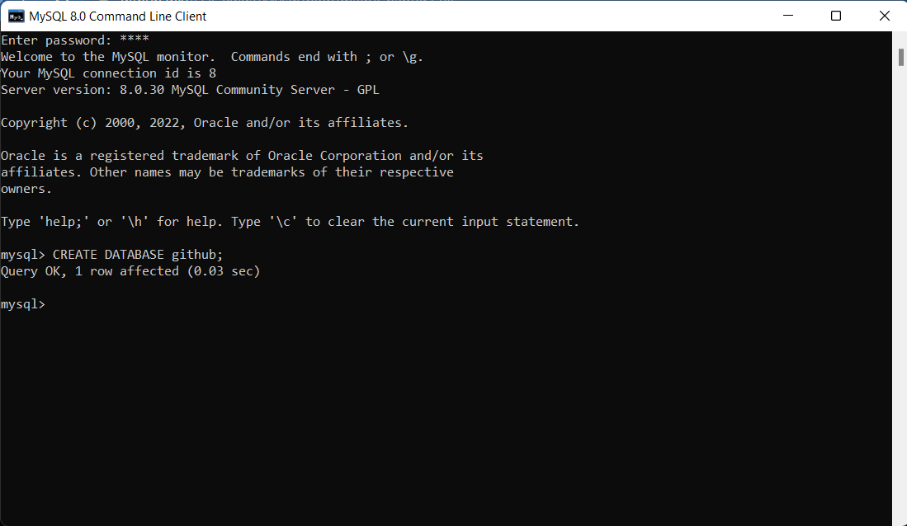
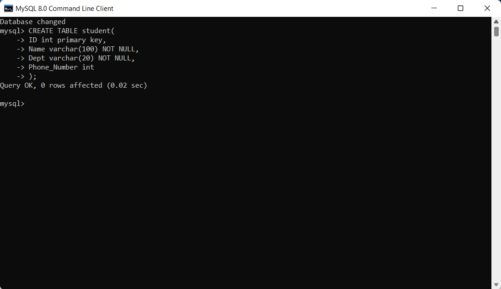
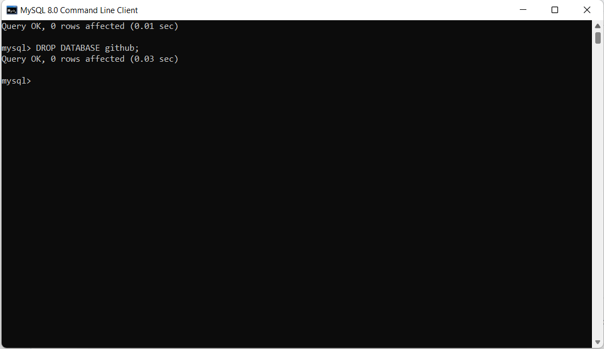

# There are four different type of SQL Commands
1) DDL(Data Definition Language)
2) DML(Data Manipulation Language)
3) DQL(Data Query Language)
4) DCL(Data Control Language)

# Here are some commands that come under DDL:
*  CREATE
*  DROP
*  ALTER
*  TRUNCATE
*  RENAME

### a) CREATE: It is used to create a new table in the database
* syntax to create Database:  

```
CREATE DATABASE Database_Name;
```  
   
Example:
```
CREATE DATABASE github;
```
<p align="center">
   
</p>
                                 
* syntax to create  a new table:

```
   CREATE TABLE Table_Name(
      Column_name1 data_type(SIZE) [Column_Constraint],
      Column_name2 data_type(SIZE) [Column_Constraint],
      Column_name2 data_type(SIZE) [Column_Constraint],
      Column_name3 data_type(SIZE) [Column_Constraint]
      );
```  
Example:

```
      CREATE TABLE student(
         ID int primary key,
         Name varchar(100) not null,
         Dept Varchar(20) not null,
         Phone_Number int
         );
```
<p align="center">
   
</p>

### b) DROP: It is used to delete both the structure and record stored in the table
* syntax to drop database:

```
DROP DATABASE Database_Name;
```

Example:

```
DROP DATABASE github;
```
<p align="center">
   
</p>

* syntax to drop table:
      
```
DROP TABLE Table_Name;
```

Example:

```
DROP TABLE student;
```
<p align="center">
   
</p>


### c) ALTER: It is used to alter the structure of the database. This change could be either to modify the characteristics of an existing attribute or probably to add a new attribute.
* synatx to add one newfield in the table:

```
ALTER TABLE Table_Name add Column_name [data_type(SIZE)];
```

Example:

```
ALTER TABLE student add Address varchar(255) not null;
```

* synatx to add multiple new field in the table:

```
ALTER TABLE Table_Name
add Column_name1 [data_type(SIZE)],
add Column_name2 [data_type(SIZE)],
add Column_name3 [data_type(SIZE)];
```

Example:

```
ALTER TABLE student
add Math_marks int not null,
add Science_marks int not null,
add English_marks int not null;
```

* synatx to change the particular column name:
   -> ALTER TABLE Table_Name change COLUMN [OLD_COLUMN_NAME] [NEW_COLUMN_NAME] data_type(SIZE);
      ex:
      ALTER TABLE student change COLUMN Dept Department varchar(100);
  
* synatx to drop a column in table:
   -> ALTER TABLE Table_Name DROP COLUMN COLUMN_name;
      ex:
      -> ALTER TABLE student DROP COLUMN Address;
      
### d) TRUNCATE: 

Here are some commands that come under DML:
-> INSERT
-> SELECT
-> UPDATE
-> DELETE

a) INSERT: It is used to insert data into a table.

b) SELECT: It is used to select data from a database.
   synatx to display the table values:
   -> SELECT * FROM Table_Name;
      Example:
      -> SELECT * FROm student;

   synatx to diaplay only particular column values:
   -> SELECT * Column_Name1, Column_Name2,_ _ _ _[Column_Name N] FROM Table_Name;
      Example:
      -> SELECT * FROM

c) UPDATE: It is used to update existing data within a table.

d) DELETE: It is used to delete records from a database table.

AGGREGATE FUNCTION
-> COUNT(): It returns the number of rows, including rows with NULL values in a group.
-> SUM(): It returns the total summed values(NON-NULL) in a set.
-> AVG(): It returns the average value of an expression.
-> MIN(): It return the minimun(lowest) value in a set.
-> MAX(): It return the maximum(highest) value in a set.
-> FIRST()
-> LAST()

CONSTRAINTS IN MYSQL:
NOT NULL:
UNIQUE:
PRIMARY KEY:
FOREIGN KEY:
DEFAULT:
CHECK: