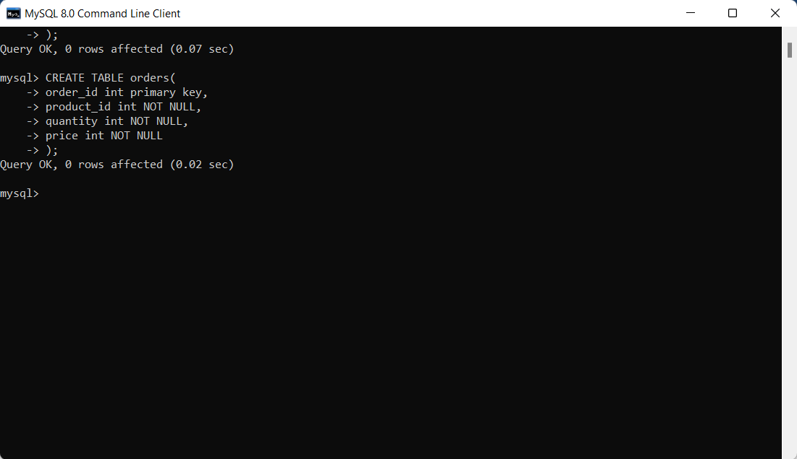
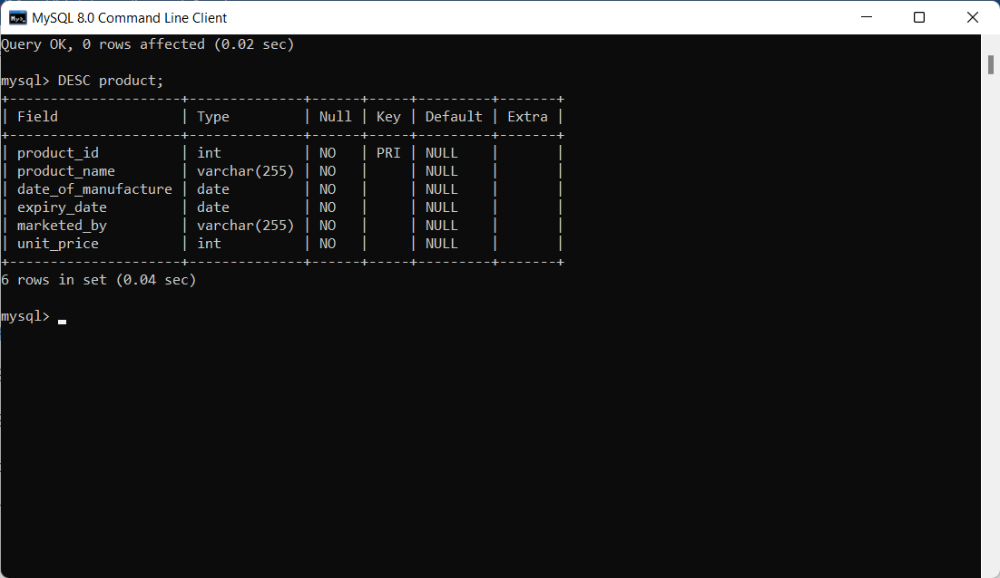
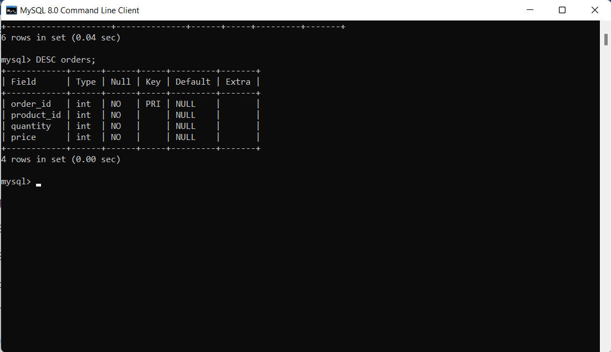
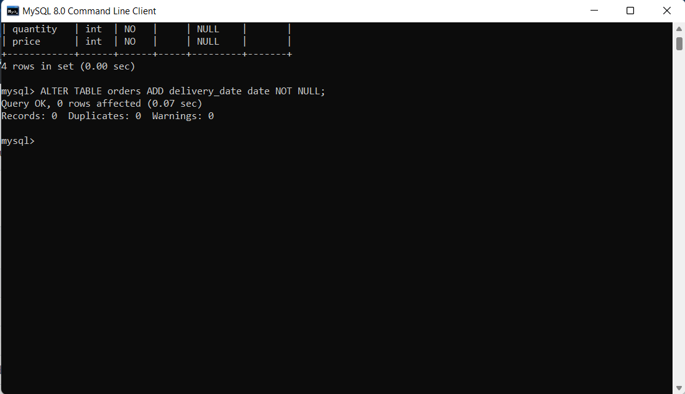
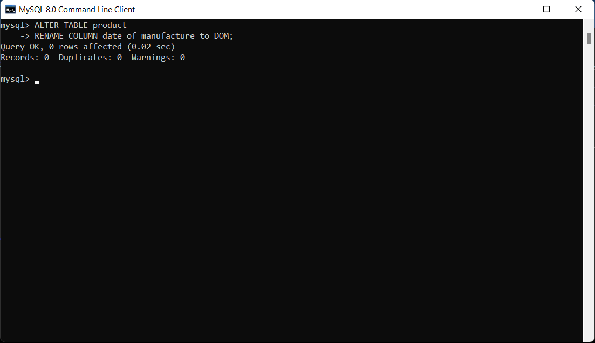
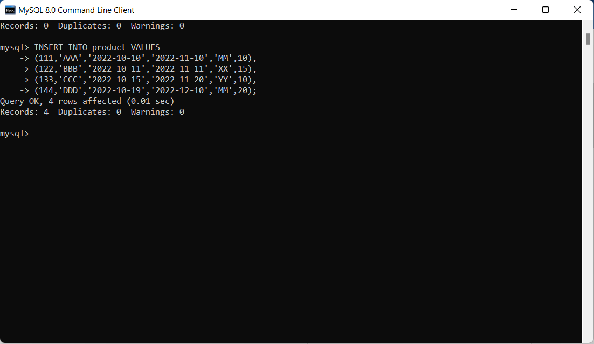

   1) create table product with fields(product id, product name, date of manufacture, expiry date, marketed by, unit price). Make  product_id as primary key.
   2) create table order with fields(order id, product id, quantity, price). Make order id as primary key and quantity should be more than 0.
   3) Display the structure of fields.
   4) Add a field delivery date in order table.
   5) change the name of field of date of manufacture to DOM.
   6) Insert atleast 4 records in each table.
   7) The order table should contain the products that are already in product table.
   8) Display the records in table.
   9) Display the marketed by names with duplicates.
   10) Modify the price field that the amount should not be zero.
   11) update the unit price of all products by 15%.
   12) Find the total price of all orders.
   13) Find the average of all orders.

# SOLUTION


#### step1: create table product with fields(product id, product name, date of manufacture, expiry date, marketed by, unit price). Make product_id as primary key.

```
CREATE TABLE product(
   product_id int primary key,
   product_name varchar(255) NOT NULL,
   date_of_manufacture date NOT NULL,
   expiry_date date NOT NULL,
   marketed_by varchar(255) NOT NULL,
   unit_price int NOT NULL
);
```
<p align="center">
   
</p>

#### step2: create table order with fields(order id, product id, quantity, price). Make order id as primary key and quantity should be more than 0.

```
CREATE TABLE orders(
   order_id int primary key,
   product_id int NOT NULL,
   quantity int NOT NULL,
   price int NOT NULL
);
```
<p align="center">
   
</p>

#### step3: Display the structure of fields.

```
DESC product;
```
<p align="center">
   
</p>
```
   DESC orders;
```
<p align="center">
   
</p>

#### step4: Add a field delivery date in order table.

```
ALTER TABLE orders ADD delivery_date date NOT NULL;
```
<p align="center">
   
</p>

#### step5: change the name of field of date of manufacture to DOM.

```  
ALTER TABLE product 
RENAME COLUMN date_of_manufacture to DOM;
```
<p align="center">
   
</p>

6) Insert atleast 4 records in each table.

```
INSERT INTO product VALUES
(),
(),
(),
();
```
<p align="center">
   
</p>
```
INSERT INTO orders VALUES
(),
(),
(),
(),
```

7) The order table should contain the products that are already in product table.

   update


8) Display the records in table.

   select * from product;

   select * from orders;

